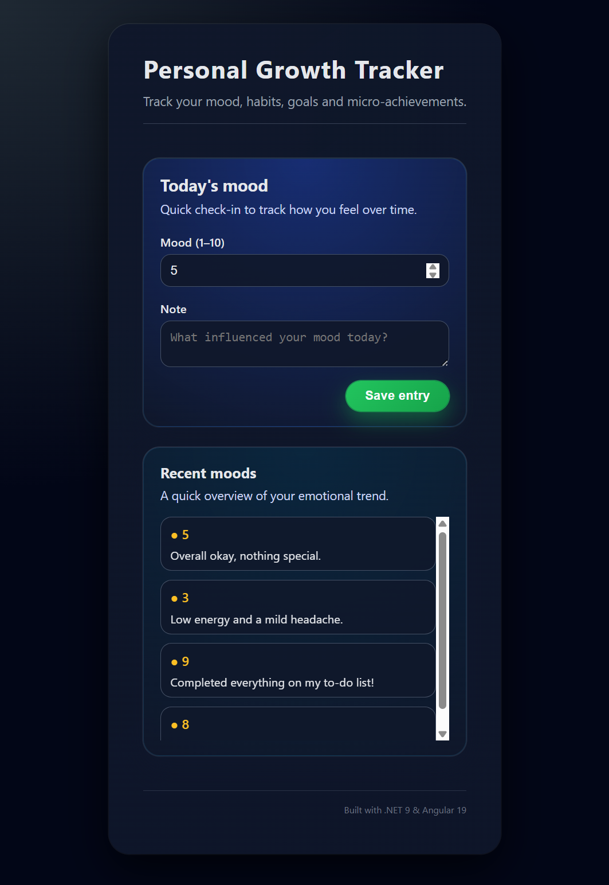

# Personal Growth Tracker

A small full-stack application for tracking daily mood and personal progress.  
Built with **.NET 9 Web API**, **Angular 19**, and **SQLite** for persistence.

The goal of the project is to keep the architecture simple and easy to follow, while still applying good practices around API design, caching and state management.

---

## Preview

<p align="center">
  
</p>

---

## Features

### Backend (.NET 9 API)
- Minimal API structure  
- Domain layer for entities and repository abstractions  
- SQLite persistence using EF Core  
- Endpoints:  
  - `GET /api/mood`  
  - `GET /api/mood/{id}`  
  - `POST /api/mood`  
- Basic logging  
- Health endpoint: `GET /health`  
- Explicit HTTP caching rules on read/write operations  

### Frontend (Angular 19)
- Mood tracker UI component  
- Form for adding mood entries  
- List of recent entries  
- Simple error handling  
- Local dev proxy for API calls  

---

## Architecture

```
/PersonalGrowthTracker.Api
  /Domain
    /Entities
    /Repositories
  /Infrastructure
    /Data
    /Repositories
  /Controllers
  Program.cs

/personal-growth-tracker-web
  /src/app
    /mood-tracker
  proxy.conf.json
```

---

## Running the project

### Backend API

```bash
dotnet run --project PersonalGrowthTracker.Api
```

This generates a local SQLite database:

```
personal_growth.db
```

### Frontend

```bash
cd personal-growth-tracker-web
npm install
npm start
```

The app is available at:

```
http://localhost:4200
```

---

## Development notes

- Read endpoints use short-lived `Cache-Control` headers  
- Write endpoints are marked as `no-store`  
- EF Core migrations manage the SQLite schema  
- Repository implementation uses EF Core (`EfMoodRepository`)  

---
